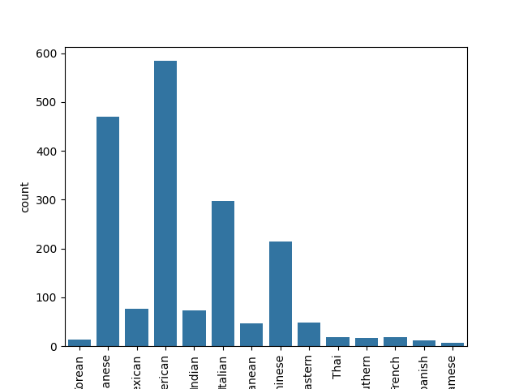
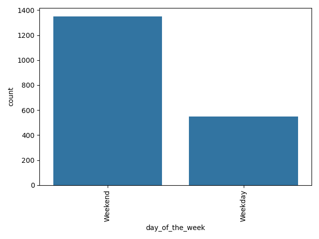
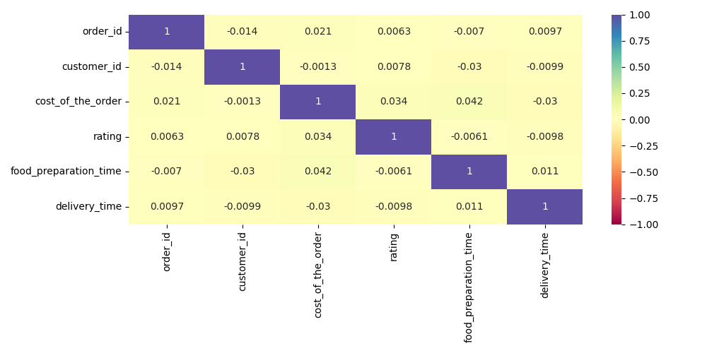

# FoodHub-Business-Insights
An exploratory data analysis of food delivery orders to uncover insights into customer behavior and restaurant performance
FoodHub Business Insights: An Exploratory Data Analysis
Project Overview
This project performs an in-depth exploratory data analysis (EDA) on the FoodHub dataset to uncover key insights into food delivery trends, customer ratings, and restaurant performance. The goal is to identify factors that influence order cost, delivery time, and customer satisfaction.

Data Source
The dataset used is foodhub_order.csv, containing anonymized order data from a food delivery service. Key features include restaurant name, cuisine type, order cost, day of the week, customer rating, and delivery logistics.   

Key Questions Explored
What are the most popular and highest-rated cuisines?

How does the cost of an order vary by cuisine and day of the week?

Is there a correlation between food preparation time, delivery time, and customer rating?

Methodology & Tools
Data Cleaning & Preprocessing: Handled missing values (e.g., 'Not given' ratings) and ensured data type consistency using Python's Pandas library.

Analysis & Visualization: Conducted statistical analysis and created visualizations using Matplotlib and Seaborn to explore relationships within the data.

## Results and Conclusions

### Customer Behavior
*   **Order Distribution:** Over 71% of orders are placed on weekends, indicating a significant concentration of activity during that time.
*   **Customer Loyalty:** A large portion of customers are first-time users, with only 232 out of 1200 customers placing more than one order. This suggests an opportunity to improve customer retention.

### Restaurant & Cuisine Insights
*   **Top Cuisines:** American, Japanese, and Italian cuisines are the most popular by order volume.
*   **Top Restaurants:** 'Shake Shack', 'The Meatball Shop', and 'Blue Ribbon Sushi' are the top-performing restaurants in terms of order count.
*   **Cuisine Ratings:** While American and Japanese cuisines dominate in volume, Indian and Mediterranean cuisines consistently receive higher average ratings.

### Operational Insights
*   **Delivery & Preparation Times:** There is a slight positive correlation between order cost and food preparation time. Delivery times are notably longer on weekdays compared to weekends.
*   **Rating & Delivery Time:** Faster delivery times show a slight correlation with higher customer ratings, suggesting that efficient delivery is a key factor in customer satisfaction.

*A countplot showing the distribution of orders across different cuisine types.*

*A countplot showing the distribution of orders on weekdays vs. weekends.*

*A heatmap showing the correlation between the numerical features in the dataset.*

Tools: 

Python
Jupyter Notebook
Numpy
Pandas
Seaborn
Matplotlib
Univariate analysis
Bivariate analysis
Exploratory Data Analysis

## Business Recommendations
*   **Enhance Weekday Engagement:** To balance the heavy weekend order volume, consider launching targeted promotions, discounts, or special menu items for weekdays.
*   **Leverage High-Rated Cuisines:** Investigate the factors contributing to the high ratings of Indian and Mediterranean cuisines (e.g., food quality, preparation techniques) and apply these insights to improve other offerings.
*   **Boost Customer Retention:** Implement a loyalty program or offer incentives for second-time orders to encourage repeat business, addressing the high number of single-order customers.
*   **Optimize Delivery Efficiency:** Since faster deliveries correlate with higher ratings, focus on optimizing weekday delivery logistics to reduce wait times and improve customer satisfaction.
